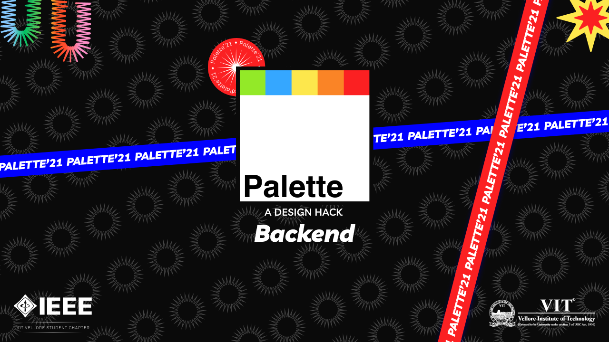

# Palette 2021 Backend



## About

Palette 2021 Backend, This project was to create a backend that ensures a smooth functioning for participants of Palette 21.<br/>
Participants can register and log in either via their Google or Figma accounts.
You can create a team or join an existing one. After registering, you can send invites to other participants who are looking for a teammate. The participant who received the invite can either accept or reject an invite.<br/>
Once the registration deadline passes, new users cannot register. Once the team formation deadline passes, you cannot change your team.<br/>
Each team can generate up to 3 new random problem statements. You and your teammate can either lock individual parts of the problem statement or the entire one at once. Once the three tries are over, your last generated problem statement is locked if you haven't locked one before it.<br/>
Each team has to submit their submission for the first round before the deadline passes. You can edit your submission as many times as you want. Once the deadline passes and the judges have released the qualified teams, the next round begins and only the qualified teams can make updates to their previous submissions accordingly for the next round.<br/>

## About the Backend

- Standard response structure was followed for a smoother integration
- Google and Figma Oauth were used for the authentication along with Passport JWT
- MVC architecture was implemented
- Robust error handling to send specific errors to the frontend for a better UX experience
- MongoDB deployed on Atlas was used as our database
- Staging branch was deployed on Heroku to test the features before they were deployed to production
- The master branch had the production code and was deployed on Microsoft Azure

## Tech Stack

- Node
- Typescript
- Express
- MongoDB
- Azure
- Heroku

## Getting Started

To get started:

- Clone the repo.
  `https://github.com/IEEE-VIT/palette-21-backend`
- Checkout to a new branch.
  `git checkout -b my-amazing-feature`
- Make some amazing changes.
- `git add .`
- `git commit -m "<verb> : <action>."`
- `git push origin my-amazing-feature`
- Open a pull request :)


To start contributing, check out [`CONTRIBUTING.md`](https://github.com/IEEE-VIT/palette-21-backend/blob/master/CONTRIBUTING.md) . New contributors are always welcome to support this project.


### Development Run

```shell
yarn install
yarn spin-up
```

### Production Run

```shell
yarn install
yarn start
```

### Postman API Documentation

[View here](https://www.getpostman.com/collections/ae244bba41f8af75dba2)

## Contributors ✨

<table>
	<tr>
		<td align="center">
			<a href="https://github.com/ShubhamPalriwala"><br /><sub><b>Shubham Palriwala</b></sub></a>
		</td>
    	<td align="center">
    		<a href="https://github.com/r-ush"><br /><sub><b>Aarush Bhat</b></sub></a>
    	</td>
    	<td align="center">
    		<a href="https://github.com/ishan-001"><br /><sub><b>Ishan Khandelwal</b></sub></a>
    	</td>
    </tr>

</table>

<br />

<p align="center">Made with ❤ by IEEE-VIT</p>
